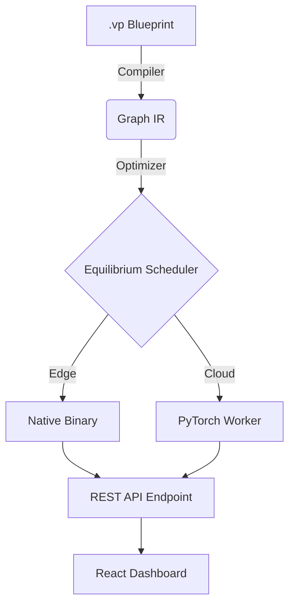

<p align="center">
  
</p>

# 🚀 Velox Proxima (VP)

[](https://opensource.org/licenses/Apache-2.0)
[](https://www.python.org/)
[]()
[]()
[]()

**The Full-Stack ML Operating System.**

Velox Proxima is an enterprise-grade, compiler-driven machine learning platform. It eliminates the friction between model research and production deployment by providing a unified DSL, a strict compile-time validation engine, and a ready-to-scale infrastructure.

---

## ⚡ Why Velox Proxima?

Modern ML development is often fragmented between messy notebooks and complex DevOps. Velox Proxima unifies the stack:

*   🧠 **Zero-Boilerplate DSL**: Define models in 11 lines that would take 150+ in PyTorch.
*   🔍 **Compile-Time Safety**: Catch `ShapeMismatchError` and architectural flaws before a single GPU cycle is wasted.
*   ⚡ **Equilibrium Scheduler**: The industry's first thermal-aware compute router that dynamically shifts loads between Edge and Cloud.
*   🐳 **1-Click Deployment**: A fully orchestrated Docker environment that launches the UI, API, and Compiler in one command.

## 🏗️ High-Level Architecture



## 🔥 Quick Example

```vp
# model.vp
layer Dense (128)
layer ReLU ()
layer Dense (?)
layer Dense (10)
layer Softmax ()

train on "mnist"
optimizer adamw lr=0.001
epochs 5
```

### 🔹 Intelligent Compiler Output
```text
[VP Compiler] Starting compilation…
[VP Compiler] Dataset = 'mnist'
[VP Compiler] Built node 0: Dense → TensorShape(64, 784)
[VP Compiler] Layer 2 (Dense) ← inferred dim = 32 (geometric mean of 128 and 10)
[VP Optimizer] ⚡ Performance Hint — Dense(10): consider 8 for better GPU efficiency
[VP Optimizer] Fused Dense+Softmax → node 606e9bb3 (activation=softmax)
[VP Compiler] Compilation SUCCESSFUL ✓
```

## 🚀 One-Click Deployment (Full Stack)

Launch the entire ecosystem (FastAPI Backend + React Frontend + ML Worker) instantly:

```bash
git clone https://github.com/LeonMotaung/velox
cd velox
docker-compose up --build
```
*   **Dashboard**: `http://localhost:3000`
*   **API**: `http://localhost:8000`
*   **Docs**: `http://localhost:3000/docs`

## 🖥️ The Developer CLI

Velox Proxima comes with a production-grade CLI to manage your models:

```bash
# Compile and validate architecture
velox compile model.vp

# Launch training and monitor via live charts
velox run model.vp

# Visualize the graph as a high-res PNG
velox visualize model.vp --output arch.png

# Perform a dry-run linting pass
velox lint model.vp
```

## 🧱 Core Features & Infrastructure

*   **TensorShape System**: Production-grade rank-4 tensor support (Batch, C, H, W).
*   **Leon Identity**: Advanced geometric-mean inference for unknown dimensions (`?`).
*   **Operator Fusion**: Automatic `Linear + Activation` fusion for reduced inference latency.
*   **Stripe Integrated API**: Ready-to-monetize inference endpoints with built-in JWT security.
*   **Edge-Ready**: Designed to compile models into native binaries for decentralized networks.

## 📂 Project Anatomy
```text
velox/
├── compiler/       # The IR Core & Shape Engines
├── engine/         # High-performance PyTorch workers
├── infrastructure/ # Deployment & Orchestration
├── __main__.py     # Unified CLI Entry Point
api.py              # FastAPI Production Gateway
frontend/           # React/Vite Dashboard & Visualizer
```

## 🌟 Stars & Support

Show your support by starring the repository! 
[](https://github.com/LeonMotaung/velox)

## 👥 Contributors

A special thanks to the pioneers building the future of Velox Proxima.

<a href="https://github.com/LeonMotaung/velox/graphs/contributors">
  
</a>

## 📜 License
Licensed under the Apache 2.0 License.

---
Built by **DeWet Technologies** | Metacognitive Infrastructure for the AI Era.
